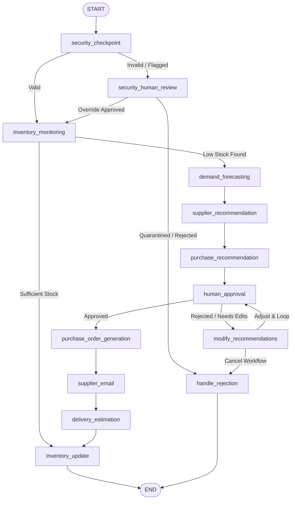

# 📊 Inventra AI: Intelligent Autonomous Retail Procurement System

[](https://adk.dev/)
[](https://github.com/google-gemini)
[](https://fastapi.tiangolo.com/)
[](https://react.dev/)
[](LICENSE)

> **Submission for the 5-Day AI Agents: Intensive Vibe Coding Capstone Project (Google & Kaggle)**
>
> *Track: Agents for Business (Enterprise Solutions & Pipeline Optimization)*

---

## 📖 Table of Contents

- [Project Overview](#-project-overview)
- [Problem Statement](#-problem-statement)
- [The Solution](#-the-solution)
- [Key Features](#-key-features)
- [Architecture & Workflow](#-architecture--workflow)
  - [Workflow Graph Topology](#workflow-graph-topology)
  - [Sequence of Operation](#sequence-of-operation)
- [Technology Stack](#-technology-stack)
- [Project Structure](#-project-structure)
- [Installation & Setup](#-installation--setup)
  - [Prerequisites](#prerequisites)
  - [Backend Setup](#backend-setup)
  - [Frontend Setup](#frontend-setup)
- [Usage Guide](#-usage-guide)
  - [Running the Local Developer Environment](#running-the-local-developer-environment)
  - [Running Evaluation & Grading Tests](#running-evaluation--grading-tests)
- [Security Considerations](#-security-considerations)
- [Screenshots](#-screenshots)
- [Future Improvements](#-future-improvements)
- [License](#-license)
- [Acknowledgements](#-acknowledgements)

---

## 🌟 Project Overview

**Inventra AI** is an intelligent, autonomous retail inventory monitoring and automated procurement planning system. Built using the **Google Agent Development Kit (ADK)**, it automates the critical operational loop of modern retail businesses: monitoring stock levels, forecasting future demand, obtaining supplier pricing/delivery terms, generating purchase recommendations, handling human approvals (HITL), drafting automated supplier emails, and estimating deliveries.

---

## ❓ Problem Statement

Small-to-medium retail and grocery businesses face significant overhead and margin losses due to inefficient procurement pipelines:
1. **Under-Stocking / Stockouts:** Missing customer demand and losing immediate sales.
2. **Over-Stocking:** Tying up working capital in slowly moving perishables.
3. **Manual Overhead:** Spending hours manually cross-checking spreadsheet inventories, calculating math baselines, drafting supplier emails, and tracking purchase order approvals.
4. **Security Vulnerabilities:** Internal inventory systems are prone to malformed data updates (negative stock) or social-engineering manipulation (prompt injection) to bypass manager authorizations.

---

## 💡 The Solution

**Inventra AI** implements an **ambient, event-driven agentic workflow** that handles end-to-end supply-chain actions:
* It continuously monitors stock thresholds and triggers automated reorders.
* It uses mathematical forecasting baseline models to calculate optimal replenishment quantities.
* It applies a robust, multi-stage **security pipeline** directly in code to intercept malicious override attempts.
* It pauses at critical decision nodes to request interactive **Human-in-the-Loop (HITL)** approvals from managers for budget overrides or adjustments, and resumes automatically when they respond.

---

## ✨ Key Features

* **Autonomous Threshold Monitoring:** Automatically filters out and raises alerts for low-stock SKUs.
* **Smart Demand Forecasting:** Combines historical daily sales figures and threshold margins to forecast optimal stock order volumes.
* **Supplier Matching & Ranking:** Evaluates registered vendor pricing, rating metrics, and shipping lead times to select the best vendor.
* **Multi-Stage Security Gateways:** 
  * Prompt injection check to block prompt-hacking phrases like `"bypass approval"` or `"force purchase"`.
  * Data validation scans to isolate negative stock values and malformed schemas.
  * Dedicated Administrator Quarantine node for system threats.
* **Human-in-the-Loop (HITL) Controls:** Halts and resumes execution natively using ADK's `ResumabilityConfig` for manager authorization. Includes a **Below-Threshold Warning** if the manager manually lowers purchase quantities below minimum safety stock.
* **Fulfillment Automation:** Generates formal purchase orders, groups them by vendor, and simulates sending email orders.
* **Vibrant Analytics Dashboard:** A beautiful React-based frontend that displays live store inventory, real-time alerts, and interactive purchase order approval widgets.

---

## 🏗️ Architecture & Workflow

### Workflow Graph Topology

The agent structure is defined in [app/agent.py](file:///C:/Users/S/.gemini/antigravity/scratch/stockpilot-ai/app/agent.py) as a directed graph workflow (`Workflow` class) mapping edges and node transitions:



### Sequence of Operation

1. **Security Entry Gate:** Checks inputs for malicious injections or illegal values (e.g. negative stock levels).
2. **Inventory Inspection:** Scans stock levels against minimum thresholds to isolate deficient SKUs.
3. **Forecasting & Logistics:** Predicts requirements and maps them to the best-rated suppliers.
4. **Approval Checkpoint (HITL):** Suspends execution, generating an interrupt payload for the manager.
5. **Modification Loop:** Allows the manager to reject and adjust order quantities.
6. **Order Dispatch & Tracking:** Finalizes POs, drafts emails, schedules deliveries, and updates stock states.

---

## 💻 Technology Stack

* **Core AI SDK:** [Google Agent Development Kit (ADK)](https://adk.dev/) (Python API) for workflows, resumability, and execution.
* **Backend Framework:** FastAPI & Uvicorn for local/ambient Pub/Sub subscription handlers.
* **Development & Tooling:** `agents-cli` for scaffolding, hot-reloading development, and running evaluations.
* **Data Schemas:** Pydantic (v2) models for structural workflow states.
* **Frontend:** React, Vite, Tailwind CSS, Lucide icons, and Chart.js for visualization.
* **Package Manager:** `uv` by Astral for fast, pinned environment management.

---

## 📁 Project Structure

```
inventra-ai/
├── .agents/                   # Workspace customizations and system instructions
├── .google-agents-cli/        # Agents CLI workspace data
├── app/                       # Core Backend Service
│   ├── agent.py               # Main agent workflow graph, security checks, and node actions
│   ├── models.py              # Pydantic data schemas (WorkflowState, SecurityEvent, etc.)
│   ├── fast_api_app.py        # FastAPI server with Pub/Sub push subscription endpoint
│   └── app_utils/             # Telemetry configuration & utility helpers
├── frontend/                  # React & Vite Dashboard App
│   ├── src/                   # Source components (Dashboard, Alerts, Analytics, KPIs)
│   ├── package.json           # Node configuration and script actions
│   └── vite.config.js         # Frontend bundling options
├── tests/                     # Verification and Eval Pipelines
│   ├── eval/                  # Scenarios, configs, and scoring datasets for agents-cli eval
│   ├── integration/           # Integration tests for agent nodes and FastAPI routing
│   └── unit/                  # Simple unit tests for core logical checks
├── pyproject.toml             # Python packages, optional dependency groups, and tool configurations
├── Makefile                   # Automated execution tasks (run, build, evaluate)
└── Dockerfile                 # Pinned python deployment image wrapper
```

---

## ⚙️ Installation & Setup

### Prerequisites
Make sure you have the following installed on your machine:
* **Python**: `3.11` up to `3.13`
* **Node.js**: Version `18+` and `npm`
* **uv**: Python environment compiler — [Install uv](https://docs.astral.sh/uv/getting-started/installation/)
* **Agents CLI**: `uv tool install google-agents-cli`

### Backend Setup
1. Clone your repository:
   ```bash
   git clone https://github.com/sartajchouhan52-source/Inventra-AI.git
   cd Inventra-AI
   ```
2. Install Python dependencies and lock local environments:
   ```bash
   uv sync
   ```
3. Set your Google GenAI credentials inside a local `.env` file:
   ```env
   GEMINI_API_KEY=your_gemini_api_key_here
   ```

### Frontend Setup
1. Navigate to the frontend directory:
   ```bash
   cd frontend
   ```
2. Install npm dependencies:
   ```bash
   npm install
   ```

---

## 🚀 Usage Guide

### Running the Local Developer Environment

You can spin up both the backend and frontend easily:

#### 1. Start the Backend Agent Server
Using the Makefile command to launch the FastAPI app in ambient event-driven mode:
```bash
make run-ambient
```
* The API server runs at: `http://localhost:8080`
* The interactive **ADK Developer Playground UI** is available at: `http://localhost:8080/dev-ui`

#### 2. Start the Frontend Dashboard
Navigate to the frontend folder and run the Vite dev server:
```bash
cd frontend
npm run dev
```
* Open your browser at: `http://localhost:5173` to see your procurement dashboard.

---

### Running Evaluation & Grading Tests

Inventra AI utilizes `agents-cli eval` to run deterministic checks on system behaviors and grade outputs using LLM-as-a-judge patterns:

1. **Simulate Scenarios and Capture Traces:**
   Runs the agent through a set of scenarios (Normal, Prompt Injection, Under-Threshold, Quantity modification, etc.) and writes log outputs:
   ```bash
   make generate-traces
   ```
2. **Grade the Traces:**
   Evaluates performance based on the constraints defined in [tests/eval/eval_config.yaml](file:///C:/Users/S/.gemini/antigravity/scratch/stockpilot-ai/tests/eval/eval_config.yaml):
   ```bash
   make grade
   ```
   * An HTML/JSON report will be generated inside `artifacts/grade_results/` showing performance scores, execution paths, and security check compliance.

---

## 🛡️ Security Considerations

* **Prompt Injection Scanners:** Scans every entry message for key manipulation commands (e.g. override, bypass, admin instructions) and diverts control to a security admin node.
* **HITL Resumability:** The system uses secure execution IDs for interrupts. State values cannot be modified during resume inputs without proper ID validation to prevent stale resume state hacking.
* **Separation of Concerns:** Database/inventory write-backs only occur *after* the workflow has fully traversed the `purchase_order_generation` phase, which is unreachable without passing through the manager validation nodes.

---

## 📸 Screenshots

| Dashboard View | Pending Approvals |
| --- | --- |
|  |  |

---
## 📸 Video Demo
https://youtu.be/yTIQWm1lvuI?si=sAFIRzLPPIuS-jIl
## 🔮 Future Improvements

1. **Standalone Model Context Protocol (MCP) Server:** Refactor local database lookups and email dispatches into separate MCP tools so that any LLM client can call them securely using standardized protocol schemas.
2. **Real-time BQ/ARIMA Integration:** Integrate direct BigQuery ML scripts to replace baseline math demand predictions with advanced historical time-series forecasting.
3. **Multi-tenant Authentication:** Restrict access using OAuth2 to verify administrator identities before allowing them to resume workflows or approve orders.

---

## 📄 License

This project is licensed under the Apache License 2.0. See the `LICENSE` file for details.

---

## 🤝 Acknowledgements

* **Google Developer Teams** for creating the Agent Development Kit (ADK) and providing the Vibe Coding Course.
* **Kaggle** for hosting the intensive Capstone Challenge.
* **Antigravity** — The AI pair-programming assistant that co-piloted the development of this codebase.
